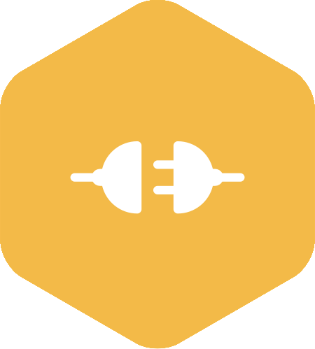

[](https://scrutinizer-ci.com/g/nystudio107/craft-connect/?branch=v1) [](https://scrutinizer-ci.com/g/nystudio107/craft-connect/?branch=v1) [](https://scrutinizer-ci.com/g/nystudio107/craft-connect/build-status/v1) [](https://scrutinizer-ci.com/code-intelligence)

# Connect plugin for Craft CMS 3.x

Allows you to connect to external databases and perform db queries



## Requirements

This plugin requires Craft CMS 3.0.0 or later.

## Installation

To install the plugin, follow these instructions.

1. Open your terminal and go to your Craft project:

        cd /path/to/project

2. Then tell Composer to load the plugin:

        composer require nystudio107/connect

3. In the Control Panel, go to Settings → Plugins and click the “Install” button for Connect.

Or you can install the plugin via the **Plugin Store** in the Craft CMS 3 AdminCP.

## Connect Overview

Connect allows you to connect to external databases of any [format that Yii2 supports](https://www.yiiframework.com/doc/guide/2.0/en/db-dao) and perform db queries using a query builder, right from your Twig templates!

## Configuring Connect

Connect must be configured via the `config.php`. This is done to keep your database connection credentials out of the any database, and also not in Git. You should use `.env` variables to store any sensitive information.

To configure Connect's settings, copy the `src/config.php` to `craft/config` as `connect.php` and make your changes there.

Once copied to `craft/config`, this file will be multi-environment aware as well, so you can have different settings groups for each environment, just as you do for `general.php`.

The default `config.php` looks like this:

```php
return [
    'connections' => [
        'remote' => [
            'driver' => getenv('REMOTE_DB_DRIVER'),
            'server' => getenv('REMOTE_DB_SERVER'),
            'user' => getenv('REMOTE_DB_USER'),
            'password' => getenv('REMOTE_DB_PASSWORD'),
            'database' => getenv('REMOTE_DB_DATABASE'),
            'schema' => getenv('REMOTE_DB_SCHEMA'),
            'tablePrefix' => getenv('REMOTE_DB_TABLE_PREFIX'),
            'port' => getenv('REMOTE_DB_PORT')
        ],
    ],
];
```

The default file uses `getenv()` to access PHP `$_ENV` variables that are set in your `.env` file. An example `.env.example` file is provided:

```
# The database driver that will be used ('mysql' or 'pgsql')
REMOTE_DB_DRIVER="mysql"

# The database server name or IP address (usually this is 'localhost' or '127.0.0.1')
REMOTE_DB_SERVER="localhost"

# The database username to connect with
REMOTE_DB_USER=""

# The database password to connect with
REMOTE_DB_PASSWORD=""

# The name of the database to select
REMOTE_DB_DATABASE=""

# The database schema that will be used (PostgreSQL only)
REMOTE_DB_SCHEMA="public"

# The prefix that should be added to generated table names (only necessary if multiple things are sharing the same database)
REMOTE_DB_TABLE_PREFIX=""

# The port to connect to the database with. Will default to 5432 for PostgreSQL and 3306 for MySQL.
REMOTE_DB_PORT="3306"
```

This should all look very familiar; it's the same way you set up db access for your Craft install, just prefixed with `REMOTE_`.

You can have as many named database connection settings as you like; in the above example, we have only one: `remote`

## Using Connect

To use Connect in your Twig templates, first you need to open a connection to a database. You do that via:

```twig

```

...where the passed in parameter (`'remote'` in this case) is the name of the connection key in the `config.php` you set up above.

Once you have a connection, you can then perform a db query using the full syntax available from the [Yii2 Query Builder](https://www.yiiframework.com/doc/guide/2.0/en/db-query-builder):

```twig


```

...where `db` is the database connection returned to you by `craft.connect.open()`. If `null` is passed in, the database that is used for the Craft CMS install will be used.

You'll be returned an array of database rows, with key/value pairs for the database columns in each row.

## Connect Roadmap

Some things to do, and ideas for potential features:

* Release it

Brought to you by [nystudio107](https://nystudio107.com/)
